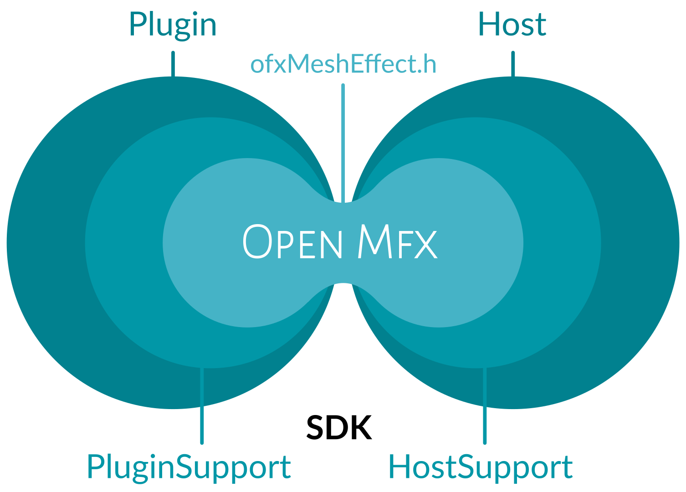

  

OpenMfx
=======

## Table of Contents

 - [What is this?](#what-is-this)
    - [The OpenFX Mesh Effect API](#the-openfx-mesh-effect-api)
    - [Why a standard](#why-a-standard)
 - [Quick Start](#quick-start)
    - [Download and run](#download-and-run)
    - [Project layout](#project-layout)
    - [Writing a plugin](#writing-a-plugin)
    - [Writing an host](#writing-an-host)
 - [Going further](#going-further)
    - [Available implementations](#available-implementations)
    - [Contributing](#contributing)
 - [License](#license)

## What is this?

### The OpenFX Mesh Effect API

OpenMfx is a plug-in standard for 3D mesh processing effects built on top of [OpenFX](http://openeffects.org/), a standard originally designed for 2D image processing.

**The official documentation of the API is located at https://openmesheffect.org**

**NB** OpenMfx was first known as "Open Mesh Effect", we decided to rename it because "OpenMfx" is easier to abbreviate and was emerging from the usage anyways.

### Why a standard?

Many 3D software feature some non destructive workflow, relying on procedural geometry effect being recomputed on the fly whenever the underlying mesh data is modified. One can quote for instance Houdini SOPs, some of Maya's nodes, or Blender's modifiers. Unfortunately, usual open exchange formats do not support these, as they might be implemented differently in different software, forcing geometries to be "baked" at export. This destructive step prevents one from tweaking the procedural parameters again. A standard description of such mesh effects will lead to effect that work exactly the same way in various software, enabling exchange formats to store meshes without baking them first.

> OpenFX has been designed for 2D images, it is completely different from 3D meshes, so why using it?

The OpenFX standard has been cleverly separated into several parts, leaving its core very generic. This OpenFX Mesh Effect API leverage on this agnostic core (called `ofxCore`) but completely ignores the image related part (`ofxImageEffect`). Instead, it defined an `ofxMeshEffect`, following similar patterns where it is relevant.

For a more complete post about the motivations behind OpenMfx, see [The need for Open Mesh Effect](https://blog.exppad.com/article/the-need-for-open-mesh-effect).

## Quick Start

### Download and run

 1. OpenMfx is a **plugin API**. In order to run a plugin, you need an OpenMfx-compliant *host*. To quickly get started, we recommend to download a release of [our Blender branch](https://github.com/eliemichel/OpenMfxForBlender/releases/latest).

 2. Then download a plugin, for instance [the MfxExamples plugin](https://github.com/eliemichel/MfxExamples/releases/latest). Unzip the archive so that you get a .ofx file. This is the plugin.

 3. Start our Blender branch, add a *modifier* to the default cube. Select new type of modifier called "OpenMfx".

 4. In the Plugin Path field, browse to the .ofx file that you downloaded at step 2.

 5. A plugin file can contain multiple effects. If the plugin loaded correctly, you can chose one from the drop down menu bellow the Plugin Path field. Choose for instance the *Explode* effect. Otherwise, you should see an error message in the modifier's UI.

 6. You may now play with the effect's parameters.

 7. An other way of using an OpenMfx plugin is as a node in a Geometry Node graph. Go to the *Geometry Nodes* tab of Blender, and press *New* in the header of the node graph area.

 8. Add a new node, search for "OpenMfx Plugin" in the Add menu. The same process as for the modifier goes, you first browse to the .ofx file, then select the effect and finally tune its parameters.

### Project layout

The API itself is only a set of headers found in [`include/`](include/). To make the creation of hosts and plugins easier, an ecosystem of C and C++ libraries has been developed around, called the [`SDK`](sdk/).

### Writing a plugin

The easiest way to write your own plug-in, is to follow the [C++ SDK tutorial](https://openmesheffect.org/Guide/TutorialCppSdk.html). You can also just start from the [MfxExamples](https://github.com/eliemichel/MfxExamples) repository and adapt it to your needs.

### Writing an host

There is no tutorial yet for this, but you can look at [`sdk/examples/cpp/host`](sdk/examples/cpp/host).

## Going further

### Available implementations

#### Hosts

Existing host software that supports OpenMfx are listed [here](https://openmesheffect.org/Implementations/HostExamples.html).

#### Plug-ins

To use existing plug-ins, check out [this list of existing plug-ins](https://openmesheffect.org/Implementations/PluginExamples.html).

### Contributing

Although the standard itself is getting more stable, help is welcome to improve the ecosystem of tools. Feel free to give some feedback through the GitHub [issues](https://github.com/eliemichel/OpenMeshEffect/issues) of this repository.

## License

OpenMfx is free and open source, and compatible with the use in commercial software. See [LICENSE.md](LICENSE.md).
