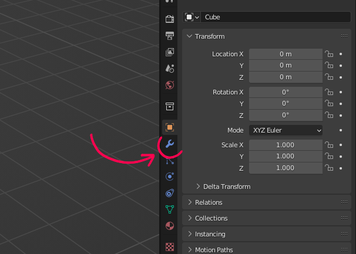
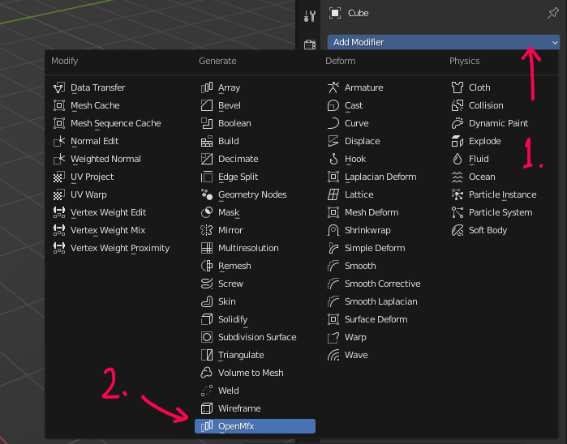
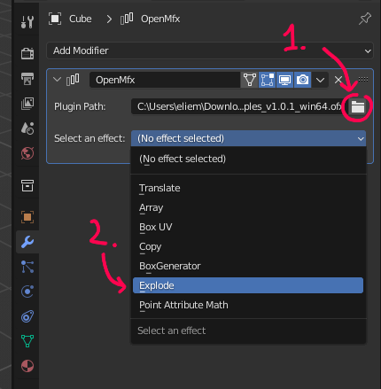
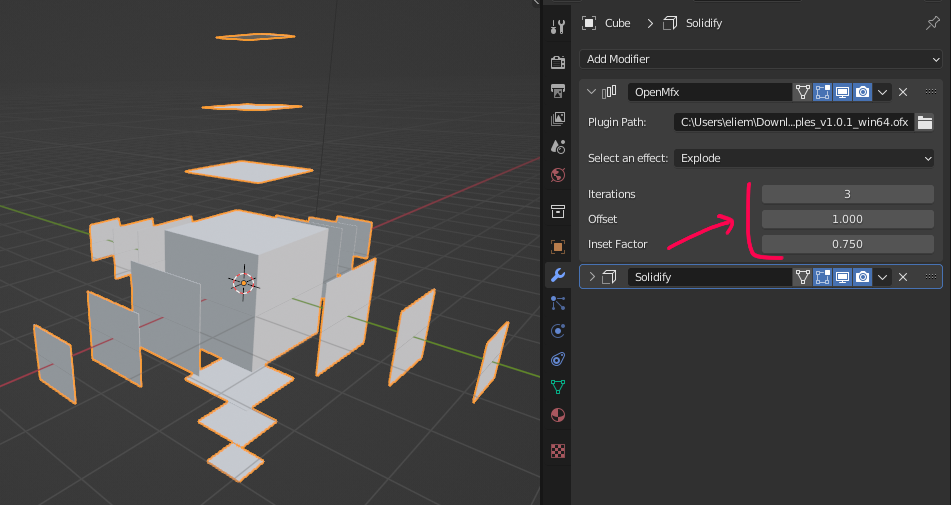
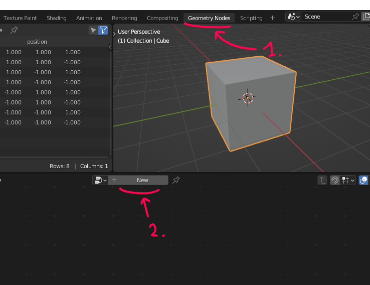
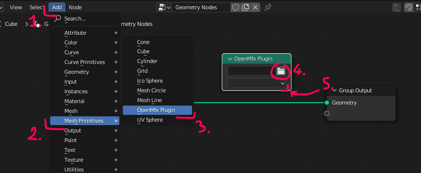
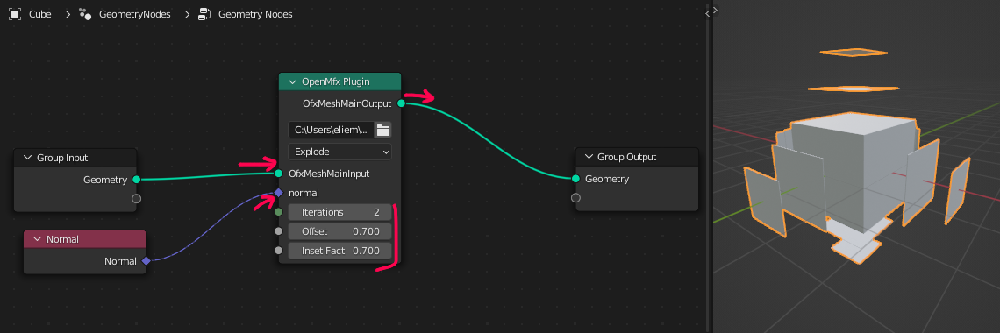

Using OpenMfx
=============

OpenMfx is a plugin API, so using it means to dynamically load a *plugin* in an *host* application that supports it.

```{warning}
Latest builds are only available for Windows. Older releases may provide binaries for other platforms but in general feel free to share your own build with us if you compile a more recent one.
```

Get an OpenMfx plugin
---------------------

Let us first get a plugin. We will use here the [MfxExamples](https://github.com/eliemichel/MfxExamples) plugin.

 1. Download the [last release](https://github.com/eliemichel/MfxExamples/releases/latest) of *MfxExamples*.

 2. Unzip the archive, you should have a file called `mfx_examples_v1.0.1_win64.ofx`

```{note}
A single .ofx file may contain multiple effects.
```

Get an OpenMfx host
-------------------

```{tip}
It is common that OpenMfx plugin projects start with "Mfx" followed by their name. On the contrary, OpenMfx hosts are usually called "SomethingMfx" or "OpenMfxForSomething".
```

The most mature OpenMfx host is [our Blender branch](https://github.com/eliemichel/OpenMfxForBlender).

 1. Download the [last release](https://github.com/eliemichel/OpenMfxForBlender/releases/latest) of *OpenMfx For Blender*.

 2. Unzip it to the location of your choice and start the `blender.exe` binary that it contains.

Run the plugin
--------------

The Blender host supports to ways of running an OpenMfx host: as a [*modifier*](https://docs.blender.org/manual/en/latest/modeling/modifiers/introduction.html) or as a [*Geometry Node*](https://docs.blender.org/manual/en/latest/modeling/geometry_nodes/introduction.html).

### As a modifier

 1. Go to the modifier property tab and add a new modifier of type *OpenMfx*.





 2. In the field *Plugin Path*, browse to the `mfx_examples_v1.0.1_win64.ofx` file downloaded earlier.

 3. The list *Select an effect* should now be populated with multiple effects, select "Explode".



 4. Play with the parameters of the *Explode* effect and look at the result updating in real time in the viewport.



### As a geometry node

 1. Go to the Geometry Nodes workspace.

 2. Create a new Geometry node graph.



 3. Add an OpenMfx node (It should eventually be in the *Mesh* section and be called "effect" rather than "plugin").

 4. In the first field, browse to the `mfx_examples_v1.0.1_win64.ofx` file downloaded earlier.

 5. The drop-down list should now be populated with multiple effects, select "Explode".



 6. Wire up the OpenMfx node and tune its parameters.


